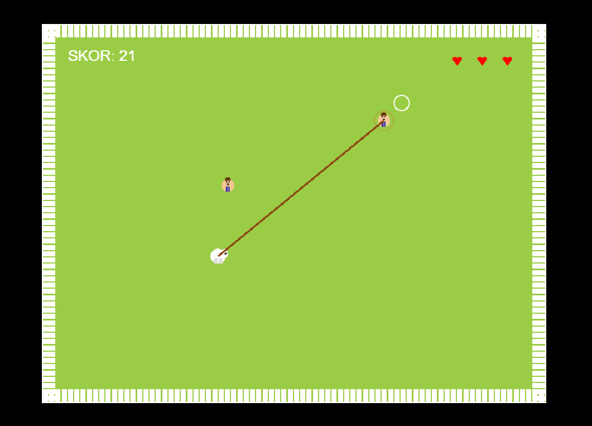
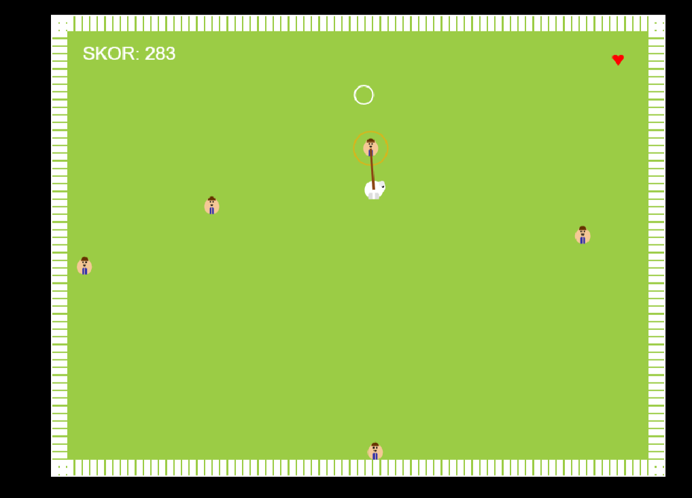
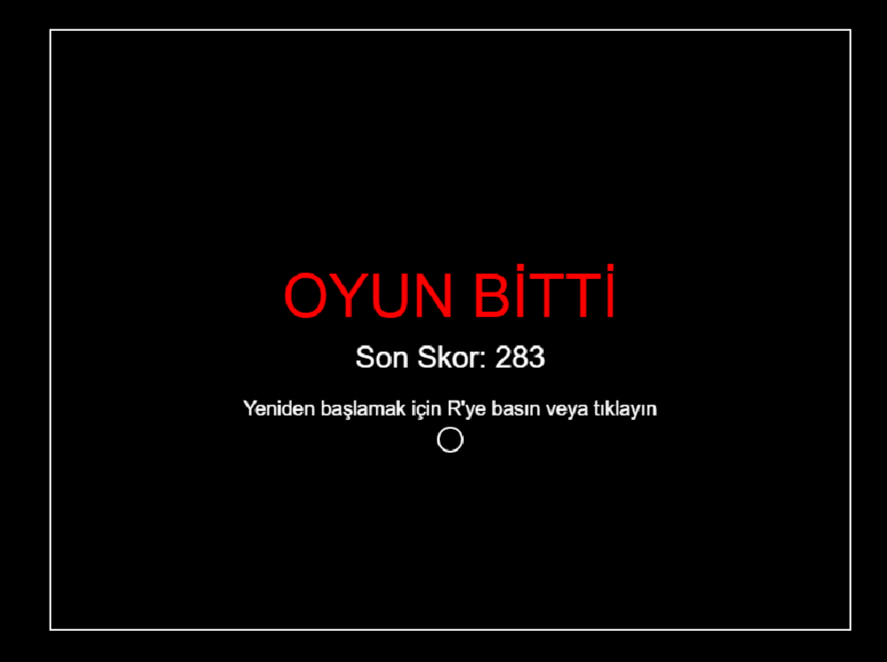

# Humans Must Not Die
-https://bemoe.itch.io/humans-must-not-die
Koyun Kovboy Oyunu, HTML5 Canvas ve JavaScript kullanılarak geliştirilmiş eğlenceli bir 2D oyundur. Oyuncular, koyun karakterini kontrol ederek insanları halat ile yakalayıp çite çarpmalarını engellemeye çalışır.


## 🎮 Oyun Hakkında
**Koyun Kovboy Oyunu**, oyuncuların bir koyun karakterini yönlendirerek haritadaki insanları halat ile yakalaması ve onların çit sınırlarına çarpmasını engellemesi gereken bir strateji ve beceri oyunudur. İnsanlar sürekli çite doğru hareket etme eğilimindedir ve onları kontrol altında tutmak giderek zorlaşır. Her insan çite çarptığında bir can kaybedilir ve toplam 3 canınız vardır. Amacınız mümkün olduğunca uzun süre hayatta kalmak ve yüksek skor elde etmektir.Genelde aim flickshot dediğimiz yeteneği iyi olan arkadaşlar çok daha yüksek skorlar yapacaktır.
## 🕹️ Oynanış Mekanikleri
Oyunda kullanılan temel mekanikler şunlardır:
- **Hareket**:
  - W, A, S, D tuşlarıyla koyun karakterini hareket ettirebilirsiniz.
  - Çapraz hareket için iki tuşa aynı anda basabilirsiniz.
- **İnsan Yakalama**:
  - Fare imleci ile insanlara tıklayarak onları halat ile yakalayabilirsiniz.
  - Yakalanan insanlar koyunu takip eder ve kaçmaya çalışır.
- **İnsan Serbest Bırakma**:
  - Yakalanmış bir insana tekrar tıklayarak onu serbest bırakabilirsiniz.
- **Çekme Mekanikleri**:
  - Yakalanan insanlar ve koyun arasında gerçekçi bir fizik simülasyonu vardır.
  - İnsan ve koyun birbirlerini çeker, koyun hareketsizken insan koyunu kendine çekebilir.
  - Tehlikeli alanlara yaklaşan insanlar içgüdüsel olarak merkeze doğru hareket etmeye çalışır.
- **Çabalama Efekti**:
  - Yakalanan insanlar ara sıra kurtulmaya çalışır , ve koyunun (kullanıcının) hareketini zorlar.
- **Ekran Görüntüleri**:



## 💻 Kurulum ve Çalıştırma
Oyunu çalıştırmak için aşağıdaki adımları izleyin:
1. Depoyu klonlayın veya dosyaları indirin:
   ```bash
   git clone https://github.com/yunuserme/yunuserme.github.io

2. Direkt link üzerinden oynayın
   ```bash
   https://yunuserme.github.io
